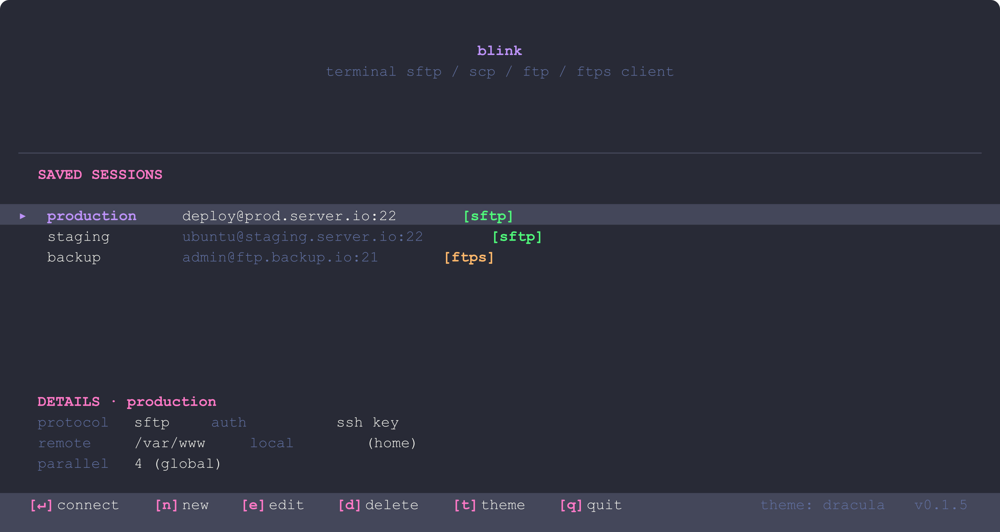

# blink

A cross-platform terminal SFTP / SCP / FTP / FTPS client with a three-pane TUI, built using Claude.




## Features

### Connectivity

- **SFTP** with password, SSH key, and encrypted-key (passphrase prompt) auth
- **SCP** as transparent SFTP — matches OpenSSH 9.0+ behavior, full feature parity
- **FTP** with anonymous and password auth
- **FTPS** with explicit TLS (RFC 4217) via rustls — pure Rust, no system
  TLS library needed
- **ssh-agent** auth on Unix (uses `$SSH_AUTH_SOCK`); Windows ssh-agent
  support is deferred — see [Honest Caveats](#honest-caveats)
- **Host-key verification** for SFTP/SCP — unknown keys trigger an
  interactive prompt (accept & save / trust once / reject); changed keys are
  hard-rejected with a clear warning. Keys are stored in
  `~/.config/blink/known_hosts` in standard OpenSSH format.
- One-key disconnect, return to selector

### Browsing & file operations

- Three-pane TUI (local / remote, plus a switchable transfers/log panel)
- Recursive **download** and **upload** with parallel slot dispatch
- **Rename**, **delete files**, **delete directories** (recursive)
- **Substring filter** per pane (`/`), persists across refresh
- **Refresh** active pane (F5)
- **Disconnect** and return to the session selector (`Ctrl-X`)
- **View** text files inline (scrollable, line-numbered) — control and
  ANSI escape characters are stripped before display to prevent terminal
  injection; see [Supported viewer formats](#supported-viewer-formats) for
  the recognised extensions
- **View** images via [kitty graphics protocol](https://sw.kovidgoyal.net/kitty/graphics-protocol/),
  [sixel](https://en.wikipedia.org/wiki/Sixel), and iTerm2 inline images —
  auto-detected, aspect-preserving, terminal-cell-aware scaling

### Transfers

- Parallel slot dispatcher (configurable globally; per-session override)
- Live transfer strip with bytes, percentage, MB/s
- **Pause / resume** all transfers (`p`)
- **Cancel** individual in-flight transfers (`c`)
- **Cancel whole batch** for recursive transfers (`C`) — aborts every
  active and queued job from the same `Ctrl-D` / `Ctrl-U`
- **Overwrite confirmation** with three choices — overwrite all / skip
  conflicts / cancel — for both downloads and uploads, single-file or
  recursive
- **Walk checkpointing** — the transfer plan is written to disk before the
  first job runs; each job is marked `in_progress` when it starts and
  `done` when it finishes. If the session is interrupted, press `r`
  (resume downloads) or `R` (resume uploads) in the Transfers pane to
  re-queue only the jobs that didn't complete. Use `blink checkpoints`
  to inspect pending checkpoints from the command line.

### Sessions

- Saved sessions in INI files; create, edit, delete from the selector
- Per-session overrides for `local_dir` (with `~` expansion), `remote_dir`,
  `parallel_downloads`, `accept_invalid_certs`, theme
- Passwords are never persisted; prompted at connect time
- Session URL parser (`sftp://user@host:port/path`) for ad-hoc connects

### Theming

Seven built-in themes — `dracula`, `aura`, `nord`, `solarized-dark`,
`solarized-osaka`, `tokyo-night`, `cyberpunk-neon` — user-supplied themes
drop in as INI files in the themes directory. **`t`** cycles through
available themes from either the session selector or the main view, with
the choice persisted to `config.ini` automatically.

## Build

### Prerequisites

- **Rust 1.85+** with the 2024 edition

That's it. Every TLS-using dependency is pure Rust (rustls), so there's no
need for `libssl-dev` or any other system TLS library on any platform.

### Build

```sh
cargo build --release
```

The binary lands in `target/release/blink`.

### Cross-platform notes

- Linux and Windows are the two officially-tested targets
- macOS should work but hasn't seen as much exercise

### Cross-compiling for Windows from Linux

You can produce a Windows binary without leaving your Linux box. There are
two routes; pick based on what's already on your system.

#### Option A — `cargo-xwin` (recommended, no Wine needed)

[`cargo-xwin`](https://github.com/rust-cross/cargo-xwin) downloads the
Microsoft CRT and Windows SDK on first use, so you don't need Wine or a
licensed Visual Studio. Best route on a clean Linux box.

```sh
# One-time setup
rustup target add x86_64-pc-windows-msvc
cargo install --locked cargo-xwin

# Build
cargo xwin build --release --target x86_64-pc-windows-msvc
```

Output: `target/x86_64-pc-windows-msvc/release/blink.exe`.

The first build downloads ~700 MB of SDK headers and libs into
`~/.cache/cargo-xwin/`; subsequent builds reuse the cache.

#### Option B — MinGW-w64 (`x86_64-pc-windows-gnu`)

If you'd rather use the GNU toolchain (no Microsoft CRT), MinGW-w64
works for blink because nothing in the dependency tree needs MSVC-only
features.

```sh
# Debian / Ubuntu
sudo apt install mingw-w64
# Fedora / RHEL
sudo dnf install mingw64-gcc

rustup target add x86_64-pc-windows-gnu
cargo build --release --target x86_64-pc-windows-gnu
```

Output: `target/x86_64-pc-windows-gnu/release/blink.exe`.

#### Notes on cross-compiled binaries

- The Windows binary is a real PE32+ executable; it runs natively on
  Windows 10 / 11 with no runtime dependencies beyond the standard
  Microsoft Visual C++ Runtime (already present on every modern Windows).
- For ARM64 Windows, swap `x86_64` for `aarch64` in either route.

## Run

```sh
# Launch into the session selector
blink

# Connect directly without a saved session
blink connect sftp://user@host:22

# Open a saved session by name
blink open production

# Print built-in themes
blink themes

# List saved sessions
blink sessions

# Show any interrupted batch-transfer checkpoints
blink checkpoints

# Remove completed and orphaned checkpoint files
blink checkpoints --clean

# Remove all checkpoint files unconditionally
blink checkpoints --force
```

`blink open` exits with an error if the session name is not found.
`blink connect` accepts any URL in the form `protocol://[user@]host[:port][/path]`
where protocol is one of `sftp`, `scp`, `ftp`, or `ftps`. Both commands
prompt for a password if the session uses password auth, or go straight to
the Connection screen for key and agent auth.

## Configuration

Files live in platform-appropriate locations:

| Path          | Linux / macOS                              | Windows                                      |
| ------------- | ------------------------------------------ | -------------------------------------------- |
| Global config | `$XDG_CONFIG_HOME/blink/config.ini` (or `~/.config/blink/`) | `%USERPROFILE%\Documents\blink\config.ini`   |
| Sessions      | `~/.config/blink/sessions/`                | `%USERPROFILE%\Documents\blink\sessions\`    |
| Themes        | `~/.config/blink/themes/`                  | `%USERPROFILE%\Documents\blink\themes\`      |
| Known hosts   | `~/.config/blink/known_hosts`              | `%USERPROFILE%\Documents\blink\known_hosts`  |
| Checkpoints   | `~/.config/blink/checkpoints/`             | `%USERPROFILE%\Documents\blink\checkpoints\` |

### `known_hosts` — SSH host key store

blink maintains its own known-hosts file separate from `~/.ssh/known_hosts`.
The format is identical to OpenSSH: one entry per line, `hostname:port key-type base64-key`.

When connecting via SFTP or SCP for the first time, blink shows a prompt with
the server's fingerprint and three choices:

| Key | Action |
| --- | ------ |
| `y` | Accept and save to `known_hosts` (future connects are silent) |
| `t` | Trust once — accept for this session only, don't save |
| `n` / Esc | Reject — abort the connection |

If a host's key changes after being saved, blink hard-rejects the connection
and shows a warning screen. To reconnect after a legitimate key rotation,
remove the old entry from the known-hosts file manually and reconnect.

### `config.ini` — global

```ini
[general]
theme = dracula             ; one of the seven built-ins, or a user theme
parallel_downloads = 2      ; default; sessions can override (max 10)
confirm_quit = true

[terminal]
image_preview = auto        ; auto | kitty | sixel | iterm2 | none
```

### `sessions/<name>.ini` — per session

```ini
[session]
name = production
protocol = sftp             ; sftp | scp | ftp | ftps
host = prod.example.com
port = 22
username = me
remote_dir = /var/www
local_dir = ~/work/prod     ; optional override; ~ expands

[auth]
method = key                ; password | key | agent
key_path = ~/.ssh/id_ed25519

[transfer]
parallel_downloads = 4      ; optional override

[appearance]
theme = tokyo-night         ; optional override

[tls]
accept_invalid_certs = false  ; FTPS only; default false. true skips cert
                              ; validation — use only for self-signed dev
                              ; servers, never for production.
```

Passwords are never written to disk.

### `themes/<name>.ini` — user themes

```ini
[theme]
name = my-theme

[colors]
bg              = #1a1b26
fg              = #c0caf5
dim             = #565f89
cursor_bg       = #282a36
border_active   = #bb9af7
border_inactive = #292e42
accent          = #f7768e
directory       = #7dcfff
image           = #f7768e
selected        = #e0af68
success         = #9ece6a
warning         = #ff9e64
error           = #f7768e
```

## Hotkeys

The full list lives in the in-app help overlay (`?`). Highlights:

| Key            | Action                                       |
| -------------- | -------------------------------------------- |
| `tab` / `S-tab`| cycle active pane (Local → Remote → Transfers → Log) |
| `↑` / `↓`      | move cursor                                  |
| `↵`            | open file or enter directory                 |
| `backspace`    | go up to parent directory                    |
| `space`        | select / deselect                            |
| `^d`           | download selected items                      |
| `^u`           | upload selected items                        |
| `v`            | view image or text                           |
| `/`            | filter current pane                          |
| `F5`           | refresh active pane                          |
| `F2`           | rename (remote pane)                         |
| `S-del` / `D`  | delete file or folder (remote pane)          |
| `^s`           | save current session                         |
| `^x`           | disconnect (return to selector)              |
| `t`            | cycle theme                                  |
| `c`            | cancel selected transfer (Transfers pane)    |
| `C`            | cancel whole batch (Transfers pane)          |
| `r`            | resume interrupted download batch (Transfers pane) |
| `R`            | resume interrupted upload batch (Transfers pane)   |
| `p`            | pause / resume all transfers                 |
| `?`            | toggle help                                  |
| `q` / `esc`    | quit (with confirmation)                     |

In the session selector: `n` new, `e` edit, `d` delete, `t` cycle theme.

## Supported viewer formats

`v` opens the in-app viewer for the cursor item. Whether a file is recognised
depends on its extension (or, for a few well-known names, the bare filename).
False negatives just mean you have to download to read it; nothing is
guessed by content sniffing.

### Images (any of the three supported terminal graphics protocols)

`.png`, `.jpg` / `.jpeg`, `.gif`, `.webp`, `.bmp`

Display caps at 10 MB to keep encode time bounded.

### Text

Display caps at 1 MB.

**Bare filenames recognised without an extension:**
`README`, `LICENSE` / `LICENCE`, `Makefile`, `Dockerfile`, `CHANGELOG`,
`AUTHORS`, `CONTRIBUTORS`, `TODO`, `NOTICE`

**Recognised extensions, by category:**

| Category    | Extensions                                                    |
| ----------- | ------------------------------------------------------------- |
| Generic     | `txt`, `md`, `rst`, `log`                                     |
| Config      | `ini`, `conf`, `cfg`, `config`, `env`, `gitignore`, `gitattributes`, `editorconfig` |
| Data        | `json`, `yaml`, `yml`, `toml`, `xml`, `csv`, `tsv`            |
| Web         | `html`, `htm`, `css`, `scss`, `sass`, `less`                  |
| JavaScript  | `js`, `mjs`, `cjs`, `ts`, `jsx`, `tsx`                        |
| Systems     | `rs`, `c`, `h`, `cpp`, `cxx`, `cc`, `hpp`, `go`               |
| Scripting   | `py`, `rb`, `lua`, `pl`, `r`, `php`                           |
| JVM/.NET    | `java`, `kt`, `swift`, `cs`                                   |
| Shell       | `sh`, `bash`, `zsh`, `fish`, `ps1`, `bat`                     |
| Database    | `sql`                                                         |
| Patches     | `diff`, `patch`                                               |
| Release     | `nfo`                                                         |

Text decoding: NFO files are decoded as CP437 (DOS codepage 437), preserving
box-drawing characters. All other text files are decoded as UTF-8 (lossy —
unrecognised byte sequences render as replacement characters rather than
failing the viewer).

If you'd like another extension recognised, the allowlist is one match arm
in `src/preview.rs::is_viewable_text`.

## Architecture

```
src/
├── main.rs              entrypoint, CLI parsing, terminal lifecycle
├── error.rs             one error enum to rule them all
├── paths.rs             platform-specific config / session / theme / checkpoint dirs
├── config.rs            global config.ini load / save
├── session.rs           per-session .ini load / save / list / URL parser
├── theme.rs             theme model + 7 built-ins + file loader
├── checkpoint.rs        walk-plan checkpointing: persist, update, and remove batch state
├── known_hosts.rs       SSH host-key store: check, append, and remove entries
├── transport/           connection layer
│   ├── mod.rs           Transport trait + factory + shared types
│   ├── sftp.rs          SFTP via russh + russh-sftp
│   ├── scp.rs           transparent SFTP wrapper (matches OpenSSH 9.0+)
│   ├── ftp.rs           FTP via suppaftp tokio backend
│   └── ftps.rs          FTPS via suppaftp + rustls (explicit TLS, pure Rust)
├── transfer.rs          TransferManager: queue, state, progress events
├── transfer/
│   └── dispatcher.rs    parallel slot dispatcher; per-job worker tasks
├── preview.rs           kitty / sixel / iterm2 detection + render backends; file classification; CP437 decoder for NFO files
└── tui/
    ├── mod.rs           terminal init / restore + run loop
    ├── app.rs           App state machine + recursive walk planning
    ├── event.rs         keyboard / app-event multiplexer
    ├── views.rs         render functions per screen / overlay
    └── widgets.rs       file pane, bottom panel, status bar, transfer strip
```

The trait boundaries that matter for extension:

- **`Transport`** in `transport/mod.rs` — implement this once per protocol.
  Adding a new protocol is one new file plus one match arm in
  `transport::open`.
- **`PreviewBackend`** in `preview.rs` — implement once per terminal-graphics
  protocol.
- **`Theme`** is just a struct loaded from INI; new themes drop in as files,
  no code changes needed.

The transfer layer has its own clean seam: `TransferManager` owns the queue
and progress channel; `Dispatcher` is a separate task that pulls pending
jobs and runs them against `Box<dyn Transport>`. The two communicate only
through the manager's public methods, so the dispatch policy can be swapped
or extended without touching the queue.

## Security

blink connects to remote servers over the open internet and renders
server-supplied content (filenames, error messages, file previews) in your
terminal. The following properties are enforced in the current codebase.

### Protocol

- **SFTP / SCP host-key verification** — unknown keys trigger an interactive
  prompt; a changed key is a hard rejection with a warning screen. Keys are
  stored in OpenSSH format under `~/.config/blink/known_hosts`.
- **FTPS** — explicit TLS only (RFC 4217), verified against the Mozilla CA
  bundle via rustls (pure Rust, no system OpenSSL). Certificate verification
  can be bypassed per-session with `accept_invalid_certs`, but only through an
  explicit UI opt-in labelled with a ⚠ warning.
- **30-second connect timeout** — applied to both the primary connection and
  every parallel worker connection. A server that accepts the TCP socket but
  stalls the handshake cannot pin connections indefinitely.

### Terminal injection prevention

All server-controlled strings pass through a sanitizer that replaces control
characters (U+0000–U+001F and U+007F–U+009F, covering ESC and all ANSI
sequence starters) with spaces before being stored or rendered:

- Remote directory-entry names (`list()` in every transport)
- SSH key-type strings and host-key fingerprints
- Error messages from transport layers
- Text file content in the viewer (tabs preserved; no length cap beyond the
  10 MB transport read limit)

### Path safety

- **Remote-to-local path traversal** — entry names containing `/`, `\`, `\0`,
  or equal to `..` / `.` are rejected before `Path::join` in download paths
  and recursive walks (`safe_local_name()`).
- **Remote path injection** — `join_remote()` strips leading `/` from
  server-supplied names and rejects any `..` component, preventing a server
  from escaping the working directory via path construction.

### Resource limits

| Resource | Limit |
| -------- | ----- |
| Text file preview read | 1 MB (at preview detection; 10 MB at transport) |
| Image file preview read | 10 MB (at preview detection and transport) |
| Decoded image dimensions | 4096 × 4096 px |
| Transfer job queue | 100,000 jobs |
| Error string length | 512 characters |
| Session / config / theme files | 64 KiB each |
| Checkpoint files | 10 MiB |
| Known-hosts file | 1 MiB |

Transport-layer read caps are enforced independently of server-reported file
sizes, so a server that lies in its directory listing cannot bypass them.

### Credential handling

- Passwords and SSH key passphrases are held in memory only for the duration
  of the connected session and are never written to disk.
- Each parallel worker slot opens its own authenticated connection and
  receives the cached credentials; no shared state crosses task boundaries.

### Config and session file safety

- Session, config, and checkpoint files are written atomically (write to
  `.tmp` sibling, then `rename`) to avoid truncated files on crash.
- Config directories are created with mode 0700 on Unix (not world-readable).
- Path-traversal and null-byte validation is applied when loading session and
  theme names from disk.

## Honest caveats

A few things worth knowing before you use this in anger:

- **FTPS is explicit-only.** The `AUTH TLS` upgrade path (RFC 4217) is what
  every modern server speaks. Implicit FTPS on the deprecated port 990 is
  not supported. If you have a server that only does implicit-mode, you'd
  need a different connect path; the `transport/ftps.rs` seam is small.
- **FTPS uses the embedded Mozilla CA bundle** (`webpki-roots`) for trust
  anchors rather than the system trust store. Self-signed certs and
  privately-rooted CAs aren't trusted by default. The per-session
  `accept_invalid_certs` toggle (visible in the edit-session form) bypasses
  all TLS certificate verification — suitable for self-signed dev servers,
  never for production. There is no option to add a custom CA root without
  recompiling.
- **ssh-agent on Windows is not supported.** The Unix path uses
  `$SSH_AUTH_SOCK`; Windows would need separate plumbing for the OpenSSH
  named pipe (and/or Pageant), which the russh 0.49 entry point doesn't
  handle uniformly. Trying agent auth on Windows surfaces a clear error.
  Use SSH key auth instead — works the same on Windows.
- **Passwords are held in memory** for the duration of the connected
  session. Each parallel transfer slot opens its own connection, so the
  dispatcher needs credentials to handshake each one. If that's not
  acceptable for your threat model, use SSH key auth or ssh-agent
  instead — the key file (or the agent's identity store) stays put and
  no in-memory copy of the secret is needed.
- **Cancellation cascades at both the single-job and batch level.** `c`
  cancels the selected transfer; `C` cancels every active and queued job
  in the same recursive batch. There is no partial-tree cancel (e.g.
  cancelling only a specific subdirectory within a larger walk).
- **Walk checkpoints survive a clean exit but not a hard kill of a running transfer.** The checkpoint file is written before each batch starts and updated as jobs complete. Jobs are marked `in_progress` when the dispatcher picks them up and `done` when they finish. A crash mid-transfer leaves the job as `in_progress`, which causes it to be re-queued on resume. Retries are safe: partial downloads are overwritten and `mkdir` is idempotent.
- **Transfers don't auto-refresh the local pane.** Use F5 to refresh after
  downloads complete.

## License

MIT. See [LICENSE](LICENSE) for the full text.

## Third-party attributions

blink is built on the following open-source libraries. Each is used as an
unmodified dependency; their licenses apply to their respective source code
and do not affect blink's MIT license except where noted.

### MIT

| Crate | Author(s) | Use in blink |
| ----- | --------- | ------------ |
| [ratatui](https://github.com/ratatui/ratatui) | ratatui contributors | TUI layout and rendering |
| [crossterm](https://github.com/crossterm-rs/crossterm) | TimonPost et al. | Cross-platform terminal I/O |
| [tokio](https://github.com/tokio-rs/tokio) | Tokio contributors | Async runtime |
| [tokio-util](https://github.com/tokio-rs/tokio) | Tokio contributors | Async I/O utilities |
| [tracing](https://github.com/tokio-rs/tracing) | Tokio contributors | Structured logging |
| [tracing-subscriber](https://github.com/tokio-rs/tracing) | Tokio contributors | Log sink / filter |
| [bytes](https://github.com/tokio-rs/bytes) | Tokio contributors | Byte buffer utilities |
| [rust-ini](https://github.com/zonyitoo/rust-ini) | Y. T. | INI config parser |
| [icy_sixel](https://github.com/nickel-lang/icy_sixel) | Mike Krüger | Sixel image encoding |
| [parking_lot](https://github.com/Amanieu/parking_lot) | Amanieu d'Antras | Faster synchronisation primitives |

### MIT OR Apache-2.0

| Crate | Author(s) | Use in blink |
| ----- | --------- | ------------ |
| [async-trait](https://github.com/dtolnay/async-trait) | David Tolnay | Async trait support |
| [futures](https://github.com/rust-lang/futures-rs) | Alex Crichton et al. | Future combinators |
| [suppaftp](https://github.com/veeso/suppaftp) | Christian Visintin | FTP / FTPS client |
| [tokio-rustls](https://github.com/rustls/tokio-rustls) | rustls contributors | Async TLS via rustls |
| [serde](https://github.com/serde-rs/serde) | David Tolnay, Erick Tryzelaar | Serialisation framework |
| [serde_json](https://github.com/serde-rs/json) | David Tolnay, Erick Tryzelaar | JSON serialisation (checkpoints) |
| [directories](https://github.com/dirs-dev/directories-rs) | Simon Ochsenreither | Platform config-dir paths |
| [clap](https://github.com/clap-rs/clap) | clap contributors | CLI argument parsing |
| [thiserror](https://github.com/dtolnay/thiserror) | David Tolnay | Error derive macro |
| [anyhow](https://github.com/dtolnay/anyhow) | David Tolnay | Error context chaining |
| [image](https://github.com/image-rs/image) | image-rs contributors | Image decoding (PNG, JPEG, GIF, WebP) |
| [base64](https://github.com/marshallpierce/rust-base64) | Marshall Pierce et al. | Base64 encoding for image preview |
| [chrono](https://github.com/chronotope/chrono) | chronotope contributors | Date / time formatting |

### Apache-2.0

| Crate | Author(s) | Use in blink |
| ----- | --------- | ------------ |
| [russh](https://github.com/Eugeny/russh) | Eugeny, Pierre-Étienne Meunier | SSH transport (SFTP / SCP) |
| [russh-sftp](https://github.com/Eugeny/russh) | Eugeny | SFTP protocol layer |

### Mozilla Public License 2.0 (MPL-2.0)

| Crate | Author(s) | Use in blink |
| ----- | --------- | ------------ |
| [webpki-roots](https://github.com/rustls/webpki-roots) | Mozilla / rustls contributors | Mozilla CA root certificates for FTPS |
